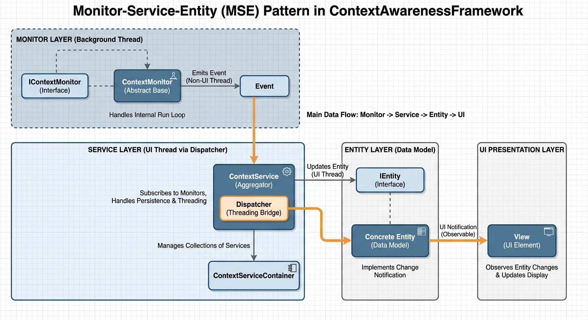

# ContextAwarenessFramework Context

## Architecture
The framework follows the **Monitor-Service-Entity (MSE)** pattern to separate concerns in context-aware applications.

## Core Components

### 1. Monitor (ContextMonitor)
*   **Role**: The source of truth. Acquires raw data from hardware, sensors, or APIs.
*   **Behavior**: Can be active (own thread/timer) or passive. Fires events when data changes.

### 2. Service (ContextService)
*   **Role**: The coordinator.
*   **Responsibilities**:
    *   Subscribes to Monitors.
    *   Applies business logic/aggregation.
    *   Updates the **Entity**.
    *   Handles **Persistence** (saving history).
*   **Threading**: Base class is thread-agnostic. It does **not** automatically marshal to the UI thread.

### 3. Entity (IEntity)
*   **Role**: The data model.
*   **Behavior**: Passive POCOs that implement `INotifyPropertyChanged`. Designed to be bound directly to UI (WPF/MAUI) or serialized for transport.

## Threading Model
*   **Isolation**: Monitors typically run on background threads to avoid blocking the UI.
*   **Marshalling**: The base `ContextService` does **not** capture a Dispatcher. Updates flow on the caller's thread (usually the Monitor's background thread).
    *   *Implication*: If `Entity` updates are bound to a UI, the specific `ContextService` implementation or the View layer must handle the marshalling to the Main Thread (e.g., using `Dispatcher.Invoke`).

## Persistence
*   **Pattern**: Template Method (`ExecutePersist`, `PersistEntities`).
*   **Modes**: `Periodic`, `OnRequest`, `Combined`.

## Do's and Don'ts
*   **Do** inherit from `ContextMonitor` for new data sources.
*   **Do** keep `IEntity` classes simple (POCOs) for easier serialization.
*   **Don't** perform heavy computation on the UI thread; let the Monitor's background thread handle data acquisition.
*   **Don't** assume `ContextService` updates run on the UI thread; always marshal if updating the View.
