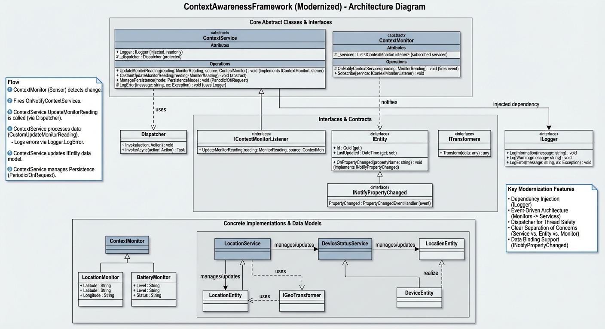

# ContextAwarenessFramework

A framework for building context-aware applications by decoupling context sensing (`ContextMonitor`) from context management and application logic (`ContextService`).

## Overview
The **ContextAwarenessFramework** provides a standard structure for:
1.  **Sensing**: Acquiring data from sensors or software events via `ContextMonitor`.
2.  **Processing**: Aggregating and transforming raw data via `ContextService`.
3.  **Data Modeling**: Representing context using `IEntity` objects.
4.  **Notification**: Thread-safe updates via observer pattern.

## Architecture
The framework follows the **Monitor-Service-Entity (MSE)** pattern, designed to decouple data acquisition from business logic and data presentation.

### Class Diagram

### MSE Pattern Diagram

## Key Components

### ContextMonitor
Abstract base class for data producers.
- **Update Types**: Continuous (event-based), Interval (polling), or OnRequest.
- **Threading**: Monitors typically run their own background loop to avoid blocking the main application.
- **Usage**: Inherit from this to create specific sensors (e.g., `LocationMonitor`, `BatteryMonitor`).

### ContextService
Abstract base class for data consumers/managers.
- **Data Aggregation**: Subscribes to one or more Monitors to process raw data into high-level context.
- **Threading**: Services are designed to be thread-safe but do **not** automatically marshal events to the UI thread. Consumers must handle cross-thread updates when binding to UI elements.
- **Persistence**: Built-in support for multiple persistence patterns:
    - `Periodic`: Saves state at a regular interval.
    - `OnRequest`: Saves state only when explicitly called.
    - `Combined`: Both periodic and on-demand.
- **Logging**: Injects `Microsoft.Extensions.Logging` for consistent diagnostic output.

### IEntity
Interface for context data objects.
- **Reactive**: Implements `INotifyPropertyChanged` for seamless integration with WPF/MAUI/Blazor data binding.
- **Usage**: Define your domain models (e.g., `UserLocation`, `DeviceState`) implementing this interface.

## Usage Example
... (rest of usage) ...

## Dependencies
- `Microsoft.Extensions.Logging.Abstractions`