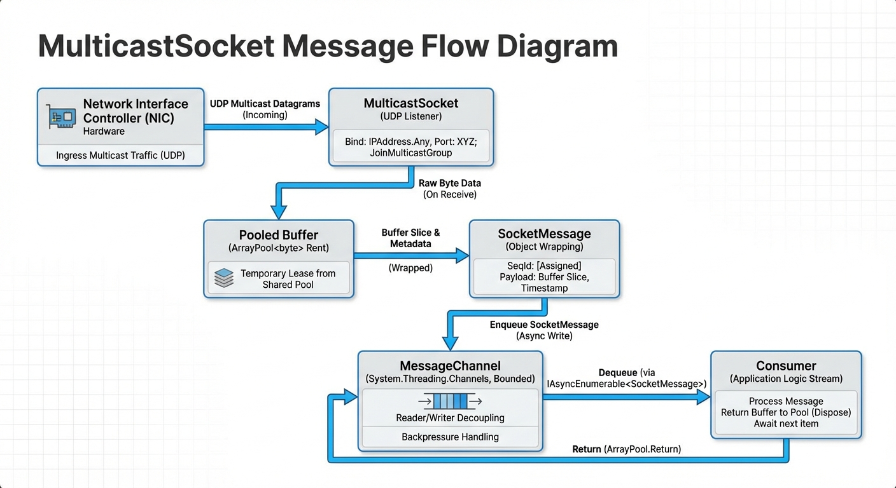

# MulticastSocket

**MulticastSocket** is the foundational networking library for the Ubicomp.Utils.NET solution. It wraps standard .NET UDP sockets to provide specific multicast capabilities with a modern, fluent API.

## Key Components
*   **`MulticastSocketBuilder`**: The primary entry point for configuration. Use this to set options, filters, and callbacks, and now supports `WithLogging` for diagnostic transparency.
*   **`MulticastSocket`**: The core engine. Handles socket creation, binding, joining multicast groups, and async I/O.
    *   *Instantiation*: Via `MulticastSocketBuilder`.
    *   *Callbacks*: Uses strongly-typed `Action` delegates (`OnMessageReceived`, `OnError`, `OnStarted`).
    *   *Reactive Streams*: Provides `GetMessageStream()` which returns an `IAsyncEnumerable<SocketMessage>` for modern streaming processing.
*   **`SocketMessage`**: Represents a received packet with data, sequence ID, and timestamp.
    *   **Pooled Buffers**: Use `IDisposable` pattern to return underlying buffers to `ArrayPool<byte>.Shared` to minimize GC allocations.
*   **`SocketErrorContext`**: Provides details about runtime exceptions.

## Diagrams




## Implementation Details
*   **Threading**: Incoming messages are offloaded to the `ThreadPool` before firing callbacks and pushing to the message stream. This ensures the receive loop remains responsive.
*   **Diagnostics**: Built-in support for `ILogger` provides granular insights into socket lifecycle, interface joining, and error conditions.
*   **Async I/O**: Supports modern Task-based sending via `SendAsync`, wrapping the internal Begin/End pattern for high performance.
*   **Buffer Management**: Uses `ArrayPool<byte>` to rent buffers for incoming messages. This significantly reduces memory allocations under high load.
*   **Sequence ID**: Every received message is assigned a consecutive ID used by higher layers (e.g., `TransportComponent`) to maintain order.
*   **Socket Options**: Sets `ReuseAddress` (SO_REUSEADDR) to allow multiple apps to bind the same port on the same machine.

## Usage

### Initialization & Receiving (Async Stream)
The recommended way to receive messages is via the `GetMessageStream` method.

```csharp
using Ubicomp.Utils.NET.Sockets;

var socket = new MulticastSocketBuilder()
    .WithLocalNetwork(port: 5000)
    .WithLogging(loggerFactory)
    .Build();

socket.StartReceiving();

// Consume messages as an async stream
await foreach (var msg in socket.GetMessageStream(cts.Token))
{
    Console.WriteLine($"Received {msg.Data.Length} bytes. Seq: {msg.ArrivalSequenceId}");
    // Note: msg.Dispose() is called automatically if you use the stream in a way that respects lifetime,
    // but explicit disposal is good practice if buffering.
}
```

### Sending Messages
```csharp
// Send raw bytes
byte[] data = Encoding.UTF8.GetBytes("Hello Multicast!");
await socket.SendAsync(data);

// Or use the string overload
await socket.SendAsync("Hello Multicast!");
```

## Dependencies
- `System.Net.Sockets`
- `Microsoft.Extensions.Logging.Abstractions`
