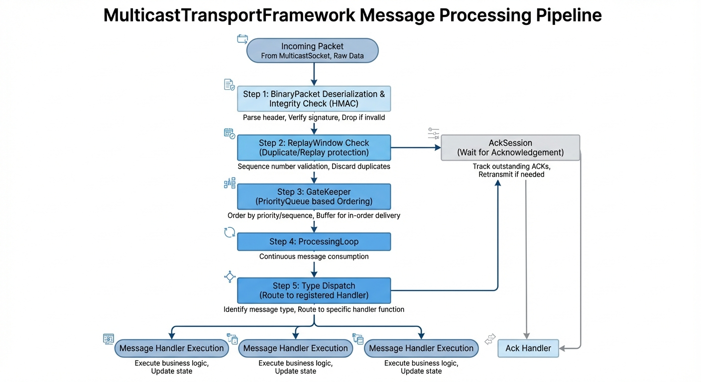

# MulticastTransportFramework

A high-level messaging framework built on top of `MulticastSocket`, providing JSON-based object serialization, type-based message routing, and a modern fluent API.

## Overview
The **MulticastTransportFramework** abstracts raw socket communication into a structured, strongly-typed messaging system. It allows applications to send and receive POCO (Plain Old CLR Objects) without dealing with byte arrays, manual serialization, or envelope management.

**Key Features:**
*   **Fluent Builder API:** guided configuration and initialization.
*   **Strongly-Typed Handlers:** Generic handlers with automatic type mapping.
*   **No Marker Interfaces:** Any class can be a message; no need to inherit from framework types.
*   **Automatic Acknowledgements:** Optional auto-ack support for reliable messaging patterns.
*   **Ordered Messaging:** Guaranteed sequential processing via an internal GateKeeper.

## System Architecture

### Class Diagram


### Message Flow


## Usage

### 1. Configure and Build
Use the `TransportBuilder` to set up your network options, logging, and message handlers.

```csharp
var options = MulticastSocketOptions.WideAreaNetwork("239.0.0.1", 5000);

var transport = new TransportBuilder()
    .WithMulticastOptions(options)
    .WithLogging(loggerFactory)
    .WithLocalSource("MyDevice")
    .WithAutoSendAcks(true) // Optional: automate acknowledgements
    .RegisterHandler<MyData>(id: 101, (data, context) => 
    {
        Console.WriteLine($"Received: {data.Value} from {context.Source.ResourceName}");
    })
    .Build();

transport.Start();
```

To enable ordered messaging (guaranteeing that messages are dispatched to handlers in the exact order they were assigned by the socket layer), set `EnforceOrdering` to `true` in the options:

```csharp
options.EnforceOrdering = true;
```

When enabled, the internal **GateKeeper** uses a buffering strategy and a recovery timeout (defaulting to 500ms) to handle out-of-order arrivals and sequence gaps.

### 2. Sending Messages
Send any object directly. The framework handles the envelope and ID mapping.

```csharp
// Simple send
await transport.SendAsync(new MyData { Value = "Hello" });

// Send with options (e.g., request acknowledgement)
var session = await transport.SendAsync(new MyData { Value = "Ping" }, new SendOptions { RequestAck = true });

session.OnAckReceived += (s, source) => Console.WriteLine($"Ack from {source.ResourceName}");
```

### 3. Manual Acknowledgements
If `AutoSendAcks` is disabled (the default), you can manually acknowledge messages using the `MessageContext`.

```csharp
transport.RegisterHandler<MyData>(101, async (data, context) => 
{
    if (context.RequestAck)
    {
        await transport.SendAckAsync(context);
    }
});
```

## Key Concepts

### TransportBuilder
The entry point for the framework. It manages the assembly of the `TransportComponent` and hides internal bookkeeping like JSON converter registration.

### MessageContext
A lightweight object passed to handlers that contains metadata about the message:
- `MessageId`: Unique GUID of the message.
- `Source`: Information about the sender.
- `Timestamp`: When the message was sent.
- `RequestAck`: Whether the sender expects a confirmation.

### Ordered Messaging (GateKeeper)
UDP multicast does not guarantee packet order. The framework ensures that messages are dispatched to handlers in the exact order they were assigned by the socket layer. The internal **GateKeeper** uses a buffering strategy and a recovery timeout (defaulting to 500ms) to handle out-of-order arrivals and sequence gaps, ensuring robustness against packet loss while maintaining state consistency.

## Dependencies
- `MulticastSocket`
- `Newtonsoft.Json`
- `Microsoft.Extensions.Logging.Abstractions`