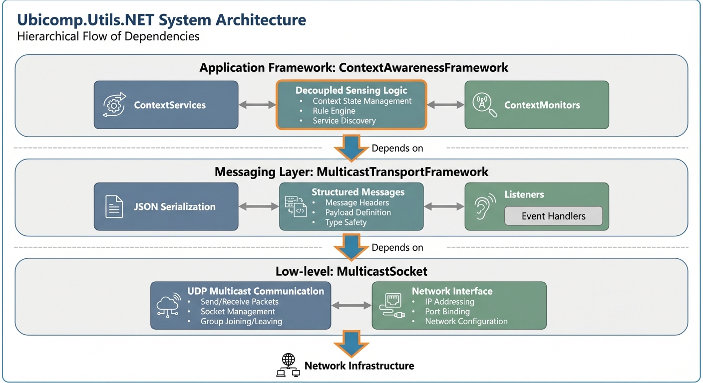

# Ubicomp.Utils.NET

A collection of .NET libraries designed to facilitate the development of context-aware and networked applications. It abstracts complex networking, messaging, and data management tasks into a layered, reusable architecture.

Created By: Juan David Hincapie-Ramos - http://blog.jhincapie.com

## Architecture
The project follows a layered architecture, ranging from low-level network transport to high-level context management.



### 1. ContextAwarenessFramework (CAF)
The top layer implements the **Monitor-Service-Entity (MSE)** pattern.
- **ContextMonitors**: Collect raw data from sensors or external APIs (active/background threads).
- **ContextServices**: Aggregate monitor data, implement business logic, and handle persistence.
- **IEntities**: Represent the data models, designed for binding (INotifyPropertyChanged).
- **Pattern**: `Monitor` -> `Service` -> `Entity`.

### 2. MulticastTransportFramework
The middle layer provides a structured, reliable messaging protocol over UDP multicast.
- **TransportComponent**: The central hub using an actor-like model for message processing.
- **Reliability**:
    - **GateKeeper**: Ensures strictly ordered message processing using sequence IDs and PriorityQueues.
    - **ReplayWindow**: Protects against replay attacks and duplicate messages.
    - **ACKs**: Optional acknowledgement sessions (`AckSession`) for critical message delivery.
- **Security**: Built-in **AES-GCM** encryption (Modern Runtimes) or **AES-CBC** (Legacy Runtimes) and **HMAC-SHA256** integrity verification.
- **Serialization**: Supports optimized `BinaryPacket` protocol and legacy JSON (via `System.Text.Json`).
- **Reactive**: Fully async processing pipeline.

### 3. MulticastSocket
The foundational layer that wraps standard .NET UDP sockets.
- **Streaming**: Exposes `IAsyncEnumerable<SocketMessage>` via `GetMessageStream()`.
- **Performance**: Utilizes `System.Threading.Channels`, `ObjectPool`, and `ArrayPool<byte>` to minimize allocations.
- **Socket Options**: Simplified configuration via `MulticastSocketOptions`.

## Project Documentation
*   [**MulticastSocket**](MulticastSocket/README.md): Low-level multicast networking wrapper.
*   [**MulticastTransportFramework**](MulticastTransportFramework/README.md): High-level messaging and transport layer.
*   [**ContextAwarenessFramework**](ContextAwarenessFramework/README.md): Framework for context sensing and data management.

## Modernization Status
This project targets **.NET Standard 2.0** for core libraries and **.NET 8.0** for applications and tests.
- **Asynchronous**: Fully utilizes `IAsyncEnumerable`, `Channels`, and `Task`-based patterns.
- **Dependencies**: Managed via NuGet.

## How to Run

### Prerequisites
*   .NET SDK (Version 8.0 recommended).

### Commands
All commands should be run from the repository root.

**Build Solution:**
```bash
dotnet build
```

**Run Sample App:**
```bash
dotnet run --project SampleApp/Ubicomp.Utils.NET.SampleApp.csproj
```

**Run Tests:**
```bash
dotnet test Tests/Ubicomp.Utils.NET.Tests.csproj
```

**Format Code:**
```bash
dotnet format
```

## Contribution Guidelines
*   **Do NOT push directly to the `master` branch.**
*   Always create a feature branch and submit a Pull Request.